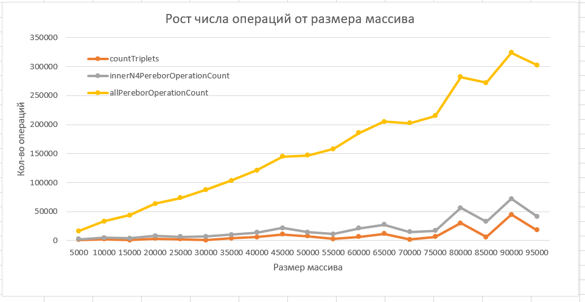
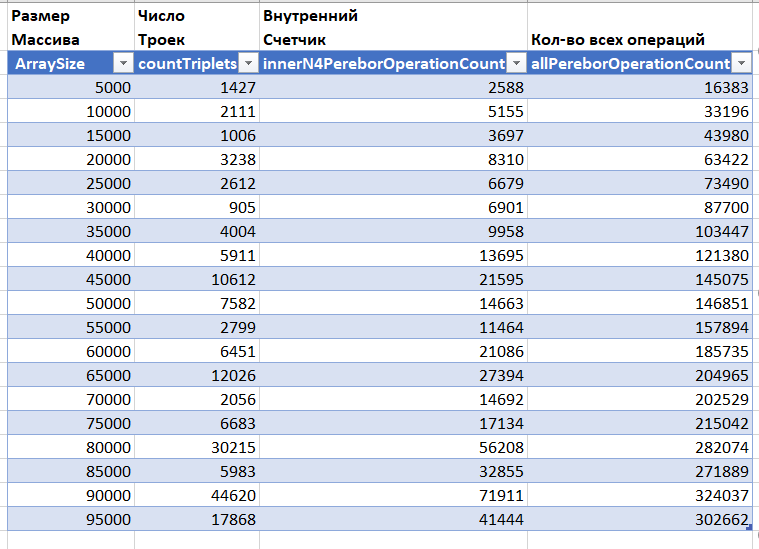

# TripleCount


Этот файл содержит решение первой задачи о подсчете количества уникальных троек в массиве входных целых чисел. 

При парном программировании онлайн было сделано переборное решение  
сложности N^4 (в четвертой степени). Ниже решение, которое показывает линейную зависимость от количества 
исходных данных. В решении выведена сложность решения - теорерически обяснено, почему она линейная.
Также линейная сложность решения подтверждается тестами. К решению приложен график с результатами запусков.
При запуске решение выводит данные, полностью подтверждающиме линейную зависимость.

Ниже привожу график зависимости и график вывода программы:




## Описание алгоритма
То, что написано ниже, прекрасно работает! Проверено. (См. график)
<br>Я использую условие, что тройка содержит числа, кратные r & r^2:
<br>```(t1, t2, t3) где t1=a, t2=a\*r, t3=a\*r^2```
<br>Считаю неоптимальным просто бегать по массиву и перебирать все элементы при сложности n^3 или n^4
я понимаю, что среди натуральных чисел квадратов относительно мало: 
<br>```1, 4, 9, 16, 25, 36, 49, 64, 81, 100, ... ```
<br>И чисел, кратных квадратам, тоже весьма мало, по сравнению с общим числом натуральных чисел!
А это значит, если набор чисел в исходном массиве sourceArray более-менее равномерно распределен,
то я весьма сокращу перебор, если выкину из перебора те числа, которые не подходят под общий вид:
<br>`a, a\*r, a\*r\*r`
<br>Обращаю внимание, что самое большое число в тройке - t3, - однозначно задает остальные числа тройки t2 и t1:
<br>	```t2 = t3/r,  t1= t3/(r\*r)```
<br>Другими словами, если я нашел в массиве все числа t3, которые кратны r^2, 
на основе их я отберу из исходного массива все числа t1 и t2. 
А это многократно сократило перебор: в идеале он линейный, что существенно меньше чем n^3 и n^4. 
<br>Я сделал ассоциативный массив, ключами которого являются числа t1, t2, t3 РЕАЛЬНО ВСТРЕЧАЮЩИЕСЯ В ТРОЙКАХ 
А значениями массива являются позиции этих чисел в исходном массиве - индексы. И на основе этого я быстро 
посчитал все значения. В линейной сложность. Код в проекте, он рабочий, запуски дали данные, которые оформлены на графике

## Оценка сложности алгоритма
Я добавил создание 2 множеств и заполнение их. 
<br>Каждое множество заполняется за 1 проход цикла. Вставка значения в множество О(1). Сложность линейная.
Я добавил создание 1 ассоциативного массива. И заполнение его. Вставка значения в ассоциативный массив О(1). 
<br>Сложность линейная.
<br>Перебор где 4 вложенных цикла сильно сокращен. У том варианте, который предлагался 
на совместной сессии программировая, сложность была n^4 (на самом деле меньше, т.к.массив 
был отсортирован и в последних двух циклах в среднем перебор заканчивался на половине цикла, 
ибо отсортировано и было условие на возрастание индекса)

<br>Здесь тоже вроде червертая степень, но не полного размера n, а (n/100) . И n^4 и (n/100)^4 - это принципиално разные вещи!
В реальности вместо 100 будет другое число, которое зависит от набора данных.
И это многократно перекрывает затраты, которые я понес, на создание двух множеств и ассооциативного массива!
Эта овчинка стоит выделки!!!

<br>ОПЫТНЫМ ПУТЕМ ВЫЯСНИЛ, ЧТО ЭТО РЕШЕНИЕ ДАЕТ ЛИНЕЙНУЮ ЗАВИСИМОСТЬ ОТ КОЛИЧЕСТВА ДАННЫХ.
<br>ЦЕЛЬ ДОСТИГНУТА ПОЛНОСТЬЮ!!!

